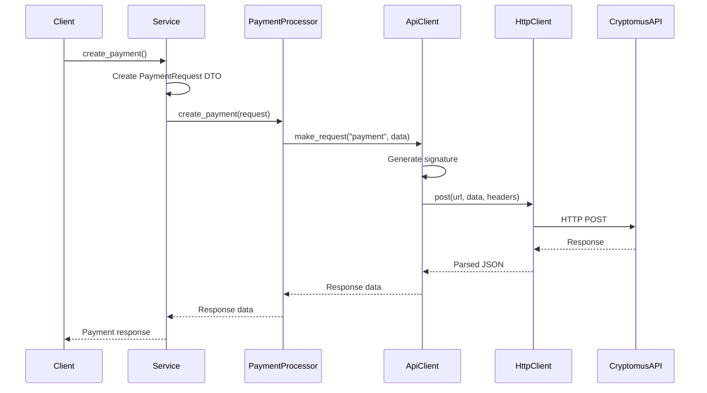
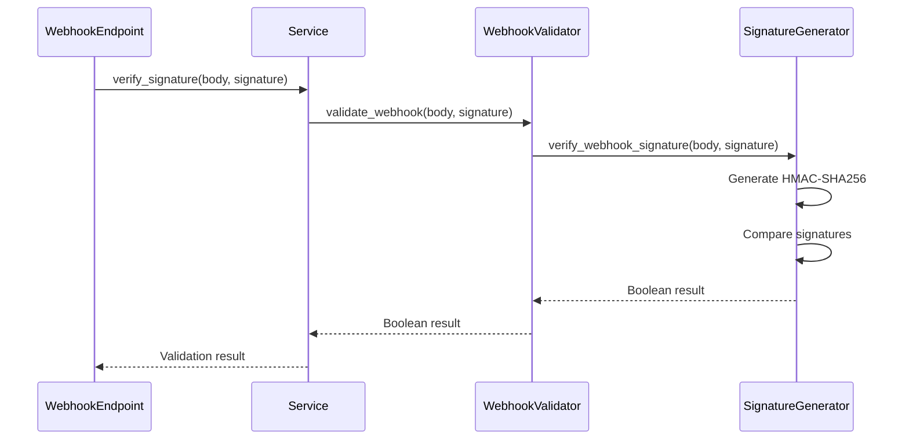

# Cryptomus Payment Service - Technical Documentation

## Overview

The Cryptomus Payment Service is a Django-based Python package that provides a clean, modular interface for integrating with the Cryptomus cryptocurrency payment gateway. The implementation follows SOLID principles and uses dependency injection to create a maintainable and testable codebase.

## Architecture Design

### Design Principles

The implementation follows several key design principles:

1. **Single Responsibility Principle**: Each class has one clear responsibility
2. **Dependency Inversion**: High-level modules depend on abstractions, not concretions
3. **Interface Segregation**: Clients depend only on interfaces they use
4. **Open/Closed Principle**: Open for extension, closed for modification

### Module Structure

```
apps/services/cryptomus/
├── __init__.py          # Package initialization and exports
├── abstracts.py         # Abstract base classes (interfaces)
├── dto.py              # Data Transfer Objects
├── implementations.py   # Concrete implementations
└── service.py          # Main service orchestrator
```

## Component Analysis

### 1. Data Transfer Objects (`dto.py`)

#### Purpose

Handles data structures and serialization for API requests.

#### Components

**`PaymentRequest`**

- Encapsulates payment creation parameters
- Provides `to_dict()` method for API serialization
- Handles optional additional parameters

**`PayoutRequest`**

- Encapsulates payout creation parameters
- Supports optional network and order_id parameters
- Provides clean data transformation

#### Key Features

- Immutable dataclasses for data integrity
- Type hints for better IDE support
- Clean serialization methods

### 2. Abstract Base Classes (`abstracts.py`)

#### Purpose

Defines contracts and interfaces for all components, enabling dependency injection and testing.

#### Components

**`SignatureGenerator`**

- Defines signature generation for API requests
- Defines webhook signature verification
- Enables different signature algorithms

**`HttpClient`**

- Abstracts HTTP communication layer
- Enables testing with mock clients
- Supports different HTTP libraries

**`PaymentProcessor`**

- Defines payment operations interface
- Separates payment logic from API communication
- Enables different payment providers

**`PayoutProcessor`**

- Defines payout operations interface
- Separates payout logic from implementation details

**`WebhookValidator`**

- Defines webhook validation interface
- Enables different validation strategies

**`ApiClient`**

- Defines high-level API communication interface
- Abstracts request/response handling

### 3. Concrete Implementations (`implementations.py`)

#### Purpose

Provides Cryptomus-specific implementations of all abstract interfaces.

#### Components

**`CryptomusSignatureGenerator`**

- Implements MD5 signature generation for API requests
- Implements HMAC-SHA256 verification for webhooks
- Handles base64 encoding and JSON serialization

```python
# API Request Signature Flow
payload_dict -> JSON string -> Base64 encode -> Concatenate with API key -> MD5 hash

# Webhook Verification Flow
raw_data -> HMAC-SHA256 with API key -> Compare with provided signature
```

**`RequestsHttpClient`**

- Uses requests library for HTTP communication
- Provides error handling and logging
- Raises appropriate exceptions for HTTP errors

**`CryptomusApiClient`**

- Combines HTTP client with signature generation
- Handles API-specific headers and authentication
- Manages base URL and endpoint construction

**`CryptomusPaymentProcessor`**

- Implements payment creation and status checking
- Uses API client for actual requests
- Provides logging for payment operations

**`CryptomusPayoutProcessor`**

- Implements payout creation and status checking
- Similar pattern to payment processor
- Handles payout-specific API endpoints

**`CryptomusWebhookValidator`**

- Implements webhook signature validation
- Uses signature generator for verification
- Provides security validation for incoming webhooks

### 4. Main Service (`service.py`)

#### Purpose

Orchestrates all components and provides a unified interface for clients.

#### Architecture

The service uses constructor injection to wire up all dependencies:

```python
# Dependency Chain
CryptomusService
├── CryptomusSignatureGenerator(api_key)
├── RequestsHttpClient()
├── CryptomusApiClient(base_url, merchant_id, signature_generator, http_client)
├── CryptomusPaymentProcessor(api_client)
├── CryptomusPayoutProcessor(api_client)
└── CryptomusWebhookValidator(signature_generator)
```

## API Flow Diagrams

### Payment Creation Flow



### Webhook Validation Flow



## Security Implementation

### API Request Security

1. **Signature Generation**:
   - Payload serialized to JSON with specific formatting
   - Base64 encoding of JSON payload
   - MD5 hash of (base64_payload + api_key)

2. **Headers**:
   - `merchant`: Merchant ID for authentication
   - `sign`: Generated signature
   - `Content-Type`: application/json

### Webhook Security

1. **HMAC Verification**:
   - Uses HMAC-SHA256 with API key
   - Constant-time comparison to prevent timing attacks
   - Raw request body used for signature generation

2. **Best Practices**:
   - Always verify signatures before processing
   - Use raw request body (not parsed data)
   - Log verification attempts for monitoring

## Error Handling Strategy

### HTTP Errors

- Uses `requests.exceptions.RequestException` base class
- Automatic HTTP status code checking with `raise_for_status()`
- Comprehensive logging of request failures

### Signature Errors

- Silent failure for invalid signatures (security)
- Detailed logging for debugging
- Boolean return values for validation methods

### Configuration Errors

- Fallback to Django settings for missing parameters
- Clear error messages for missing configuration

## Logging Implementation

### Logging Levels

- **DEBUG**: Detailed signature generation and response data
- **INFO**: Operation starts, status checks, verification results
- **ERROR**: HTTP failures, signature generation errors

### Logger Naming Convention

```python
logger = logging.getLogger(f"{__name__}.{self.__class__.__name__}")
```

This creates hierarchical loggers like:

- `apps.services.cryptomus.implementations.CryptomusSignatureGenerator`
- `apps.services.cryptomus.service.CryptomusService`

## Testing Strategy

### Unit Testing Approach

1. **Mock External Dependencies**: HTTP clients, API responses
2. **Test Each Component Independently**: Signature generation, processors
3. **Verify Interface Compliance**: All implementations follow abstracts
4. **Test Error Conditions**: Network failures, invalid signatures

### Integration Testing

1. **End-to-End Flows**: Complete payment/payout cycles
2. **Webhook Processing**: Full signature verification flow
3. **Configuration Testing**: Different settings combinations

## Performance Considerations

### Signature Generation

- MD5 is fast but consider security implications
- Base64 encoding adds minimal overhead
- JSON serialization uses compact format

### HTTP Requests

- Uses connection pooling via requests library
- Consider implementing retry logic for production
- Add timeout configurations for better reliability

### Memory Usage

- DTOs are lightweight dataclasses
- No persistent state in service classes
- Stateless design enables easy scaling

## Extension Points

### Adding New Payment Providers

1. Implement abstract interfaces for new provider
2. Create provider-specific signature generator
3. Add provider-specific API client
4. Update main service to support provider selection

### Custom HTTP Clients

1. Implement `HttpClient` abstract class
2. Add custom error handling or retry logic
3. Support different authentication methods
4. Add custom headers or middleware

### Enhanced Webhook Processing

1. Extend `WebhookValidator` for additional checks
2. Add webhook payload parsing and validation
3. Implement webhook retry mechanisms
4. Add webhook event routing

## Deployment Considerations

### Environment Configuration

```python
# Production settings
CRYPTOMUS_API_KEY = os.getenv('CRYPTOMUS_API_KEY')
CRYPTOMUS_MERCHANT_ID = os.getenv('CRYPTOMUS_MERCHANT_ID')

# Optional: Custom base URL for testing
CRYPTOMUS_BASE_URL = os.getenv('CRYPTOMUS_BASE_URL', 'https://api.cryptomus.com/v1')
```

### Security Checklist

- [ ] API keys stored securely (environment variables)
- [ ] Webhook endpoints use HTTPS
- [ ] Signature verification implemented correctly
- [ ] Error messages don't expose sensitive data
- [ ] Request/response logging configured appropriately
- [ ] Rate limiting implemented for webhook endpoints

### Monitoring

- Set up logging aggregation for service logs
- Monitor API response times and error rates
- Track signature verification failures
- Alert on unusual payment/payout patterns

## Maintenance Guidelines

### Code Updates

1. Follow existing patterns and abstractions
2. Add comprehensive tests for new features
3. Update documentation for API changes
4. Maintain backward compatibility when possible

### Dependency Management

- Keep requests library updated for security
- Monitor Django compatibility
- Test with different Python versions if needed

### API Version Management

- Abstract API version in base URL configuration
- Add version-specific implementations if needed
- Maintain compatibility layers for API changes
